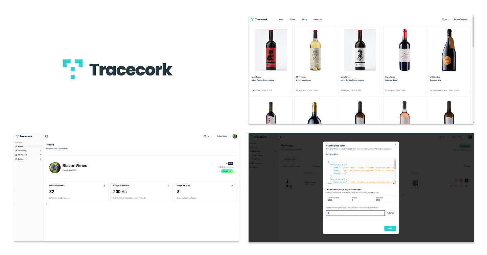
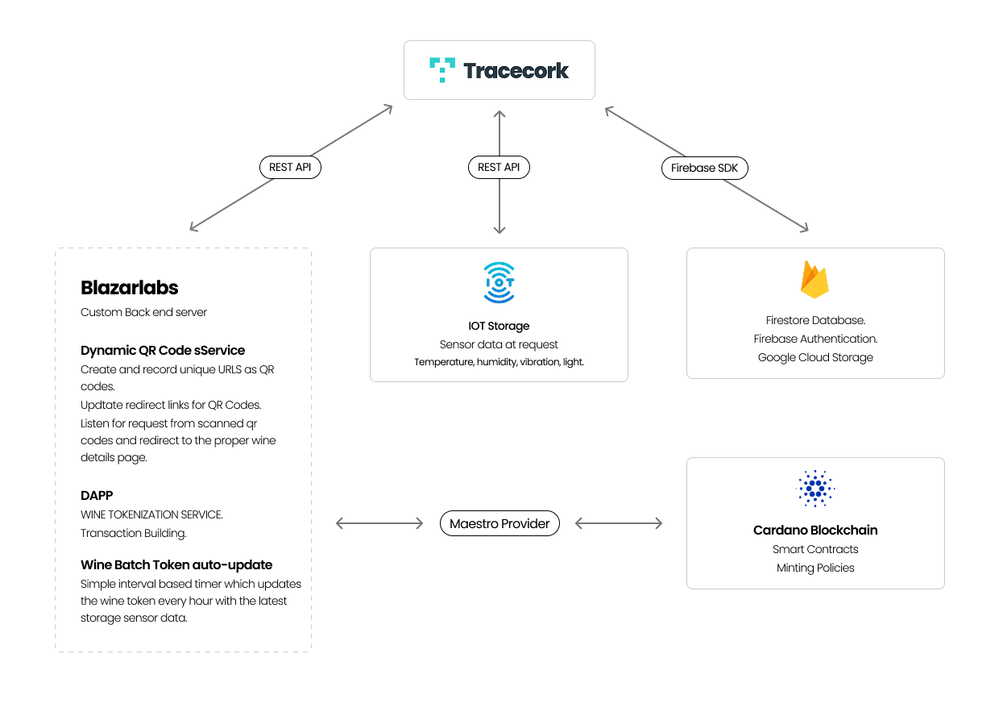
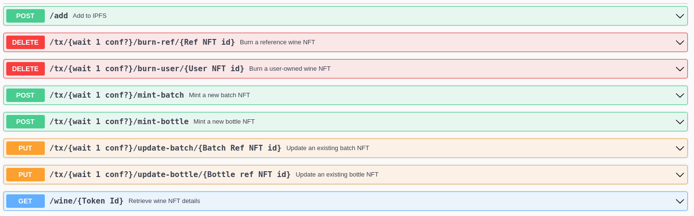

# Tracecork Monorepo

## Table of Contents

- [Overview](#overview)
- [System Architecture](#system-architecture)
- [Project Structure](#project-structure)
  - [Apps](#apps)
  - [Packages](#packages)
- [Getting Started](#getting-started)
  - [Prerequisites](#prerequisites)
  - [Dependencies](#dependencies)
  - [Installation](#installation)
- [Configuration](#configuration)
  - [Environments](#environments)
  - [Environment Variables](#environment-variables)
  - [Admin](#admin)
  - [CMS](#cms)
  - [Web](#web)
  - [Setup Wine Tokenization Service](#setup-wine-tokenization-service)
  - [Setup Third Party Clients](#setup-third-party-clients)
- [Licenses](#licenses)

## Overview

This mono-repository includes all apps and packages used within the ecosystem of [Tracecork](https://www.tracecork.com/). All the apps share common dependencies and configuration, allowing you to focus on the specific features of each app, while keeping homogeneity between them as the main component/ui library is used across the whole ecosystem.

## System Architecture



## Project Structure

```
📦 tracecorck-turbo
├─ apps
│  ├─ admin
│  ├─ cms
│  ├─ token-update-server
│  └─ web
├─ assets
└─ packages
   ├─ eslint-config
   ├─ typescript-config
   └─ ui
```

## Getting Started

This ecosystem of apps has been developed on Linux POP OS 22.04.

### Prerequisites

- [Node.js](https://nodejs.org/en/download/)
- [pnpm](https://pnpm.io/)

### Dependencies and third party services

- [Next.js](https://nextjs.org/)
- [TypeScript](https://www.typescriptlang.org/)
- [TailwindCSS](https://tailwindcss.com/)
- [Shadcn UI](https://shadcn.com/)
- [Zod](https://zod.dev/)
- [React Hook Form](https://react-hook-form.com/)
- [React Query](https://tanstack.com/query/v4/)
- [firebase](https://firebase.google.com/)
- [firebase-admin](https://firebase.google.com/docs/admin/setup)
- [vercel](https://vercel.com/)
- [sendgrid](https://sendgrid.com/)
- [sanity](https://www.sanity.io/)

### Installation

Clone this repository and run the following command:

```bash
pnpm install
```

## Configuration

### Environments

Tracecork currently works on 3 different environments: **development**, **staging** and **production**. Each one has its own configuration and dependencies.

### Environment Variables

Each app in the /apps folder has its own .env files, one per environment. Any of these apps will need at least two .env files:

      .env.development

      .env.production

Here, the development environmental variables will be used to run the app in development mode (locally) and necessary to run the staging app once deployed to vercel under our "development" github branch.

### Admin

The admin app is the one that will be used by the company's employees to conduct administrative operations on our back end.

To run the admin app locally, run the following command:

```bash
pnpm dev --filter admin
```

### CMS

The CMS app is the one that will be used by the company's employees to manage the content of the website in **20+ languages**.

To run the CMS locally, run the following command:

```bash
pnpm dev --filter cms
```

### Web

The web app is the one that will be used by the company's customers to register their wine collections following EU regulations and generate printable QR codes for their wines.

To run the web locally, run the following command:

```bash
pnpm dev --filter web
```

### Setup Wine Tokenization Service

The wine tokenization service is a separate app, which is used to tokenize wines on the Cardano blockchain. Tracecork interacts with this service through a custom API. Find all the necessary information in the [wine-tokenization-service](https://github.com/mariusgeorgescu/wine-tokenization-service) repository. The endpoints allows tracecork web to tokenize wines on the blockchain through a series of fetches using the custom API.



### Setup Third Party Clients

Tracecork uses a few third party services in order to facilitate the enabling and maintenance of certain features. These services are:

- [Sendgrid](https://sendgrid.com/)
- [Sanity](https://www.sanity.io/)
- [Firebase](https://firebase.google.com/)

You will find the client configuration for each of these under the src/lib/ folder within each APP. For example, the firebase client configuration is located in the src/lib/firebase/client.ts file. The environmental variables for each of these services are located in the .env files.

## Licenses

- [APACHE2 License](https://www.apache.org/licenses/LICENSE-2.0)
